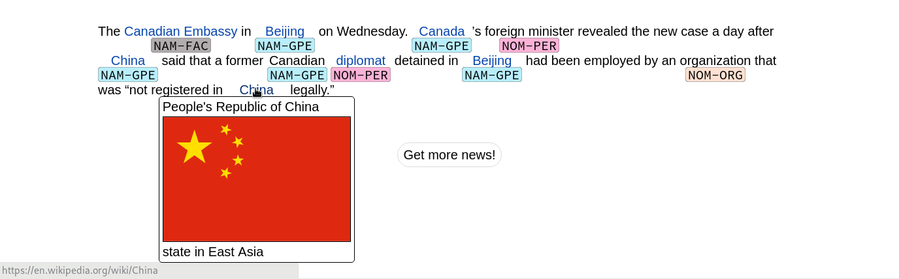

# Entity Discovery and Linking

Read the paper [here](paper.pdf).
This project was originally developed as part of the course [EDAN70 Project in Language Technology](http://cs.lth.se/edan70/projects-in-language-technology/)
at Lund University.

## Abstract

In this paper we outline an attempt to build
a system for Trilingual Entity Discovery
and Linking (TEDL) based on a paper by
Yang et al. (2017). Entity Discovery and
Linking is the problem of finding and identifying names of people, organizations, locations and so on (i.e. entities) in arbitrary
unstructured bodies of text.
The solution to this problem can be divided into two distinct parts: Mention Detection (MD) – the process of detecting
and capturing sequences of words as references to an entity, and Entity Linking (EL)
– the linking of a detected entity in the text
to an existing entity. This latter step requires disambiguating the detected entity
from a list of possible candidates of existing entities based on some set of heuristics.
Our model for detecting entity mentions
is based on a deep neural network consisting of two Bidirectional Long ShortTerm Memory (BiLSTM) layers. The entity linking is accomplished by creating a
mapping from words to Wikipedia articles
and generating a list of candidates from
that mapping for each detected entity.
We also describe a graphical interface for
demonstrating our system where news articles are fetched and annotated with entity
classifications and Wikipedia links.
We evaluate the system using neleval
(Nothman et al., 2014) on data from the
Text Analysis Conference (TAC) 2017 and
achieve F1 scores of 0.692 in strong typed
mention match and 0.494 in strong typed
all match.
